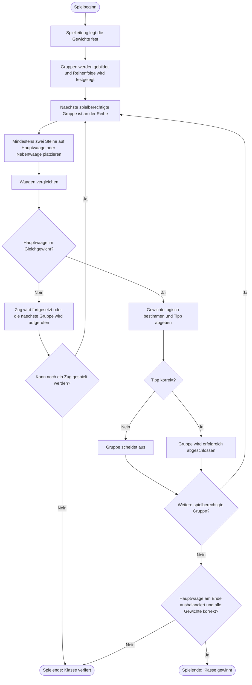

# Spielanleitung und Analyse

## Kurzfassung

Beim Waagenspiel ermitteln Gruppen die unbekannten Gewichte symbolischer Steine. Jede Gruppe besitzt eine Hauptwaage und eine Nebenwaage (in der urspruenglichen Beschreibung auch Zweitwaage genannt). Durch das Platzieren der Steine und den Vergleich der Waagen sollen die Gewichte logisch bestimmt werden.

Die Klasse gewinnt nur, wenn die Hauptwaage am Spielende ausbalanciert ist und alle Gewichte korrekt bestimmt wurden.

## Festgelegte Regeln

- Die Klasse wird in sechs oder sieben Gruppen aufgeteilt.
- Es gibt fuenf Steinfarben: Rot, Gelb, Gruen, Blau und Lila.
- Jede Gruppe erhaelt zwei Steine aus dieser Auswahl.
- Das Gewicht jedes Steins ist eine natuerliche Zahl zwischen 1 g und 20 g.
- Die Steine sind nur Symbole; die echten Wuerfelgewichte sind nicht relevant.
- Steine duerfen nicht zwischen Gruppen getauscht werden.
- Jede Gruppe hat eine Hauptwaage und eine Nebenwaage.
- Die Hauptwaage muss am Ende ausbalanciert sein. Die Nebenwaage dient nur zur Unterstuetzung.
- Die Reihenfolge wird mit Stickern festgelegt.
- In einem Zug muss eine Gruppe mindestens zwei Steine platzieren.
- Beide Waagen duerfen gleichzeitig verwendet werden.
- Auf der Hauptwaage duerfen keine gleichen Steine liegen.
- Platzierte Steine duerfen nicht mehr verschoben werden.
- Nach einer ausbalancierten Waage darf das Gewicht der Steine geraten werden.
- Ein falscher Tipp scheidet die Gruppe aus.
- Eine Gruppe darf nicht mehr raten oder mitspielen, wenn sie alle Steine oder nur noch einen Stein uebrig hat.
- Das Spiel endet, wenn keine Gruppe mehr Steine platzieren kann.

## Spielablauf

1. Die Spielleitung legt die Gewichte fest und verteilt die Steine.
2. Die Gruppen bestimmen ihre Reihenfolge.
3. Die jeweils aktive Gruppe platziert mindestens zwei Steine auf der Haupt- oder Nebenwaage.
4. Die Ergebnisse der Waagen werden fuer alle sichtbar gemacht; angezeigt wird, welche Seite schwerer ist oder ob Gleichgewicht besteht. Die exakten Gewichte bleiben verborgen.
5. Bei einer ausbalancierten Hauptwaage darf die Gruppe einen Tipp abgeben.
6. Nach jedem Zug wird die naechste spielberechtigte Gruppe aufgerufen.
7. Das Spiel endet nach dem letzten moeglichen Zug.
8. Die Spielleitung prueft die Hauptwaage und alle Tipps.

## Gewinnbedingung

Die Klasse gewinnt, wenn beide Bedingungen erfuellt sind:

1. Die Hauptwaage ist ausbalanciert.
2. Alle gesuchten Gewichte wurden richtig bestimmt.

Andernfalls verliert die Klasse.

## Unklare Punkte, die vor dem Spiel festgelegt werden sollten

- Sind gleichfarbige Steine in verschiedenen Gruppen immer gleich schwer oder hat jeder einzelne Stein ein eigenes Gewicht?
- Was genau bedeutet "gleiche Steine" auf der Hauptwaage: gleiche Farbe, gleiche Anzahl oder identische Kombinationen auf beiden Seiten?
- Darf eine Gruppe in einem Zug Steine auf beide Waagen verteilen?
- Wann ist eine Runde beendet und wann beginnt die naechste Runde?
- Muss ein Tipp das Gewicht jedes platzierten Steins oder nur eines ausgewaehlten Steins nennen?
- Wie wird mit einer Waage umgegangen, die waehrend des Zuges nicht ausbalanciert ist?
- Wie wird bei mehreren gleichzeitigen Aktionen die Reihenfolge der Auswertung bestimmt?

## Aktueller Umsetzungsstand der iPad-Version

Die iPad-Version verwendet derzeit drei Gruppen mit jeweils zehn Steinen. Das ist ein technischer Startwert und ersetzt nicht die festgelegte Regel, nach der die Spielleitung sechs oder sieben Gruppen mit jeweils zwei Steinen vorbereiten soll. Eine frei waehlbare Gruppenzahl und Steinmenge ist als Erweiterung vorgesehen.

Die iPad-Version zeigt bei jeder Waage nur den Vergleich an: `Linke Seite schwerer`, `Rechte Seite schwerer` oder `Im Gleichgewicht`. Die Nebenwaage liefert einen zusaetzlichen Vergleich; nur ein Gleichgewicht der Hauptwaage kann die aktuelle Gruppe loesen.

## Regeltechnische Bewertung

Das Spiel verbindet Experimentieren mit logischem Schlussfolgern. Die Nebenwaage erlaubt Hilfsmessungen, waehrend die Hauptwaage eine gemeinsame Zielbedingung vorgibt. Die Regel, platzierte Steine nicht mehr zu verschieben, macht jede Entscheidung dauerhaft und erhoeht den taktischen Anteil.

Fuer eine faire Runde muessen die unbekannten Gewichte mit den erlaubten Waagen tatsaechlich eindeutig bestimmbar sein. Die Spielleitung sollte deshalb vorab eine Loesung pruefen oder ein vorbereitetes Gewichtsszenario verwenden.

## Ablaufdiagramm

